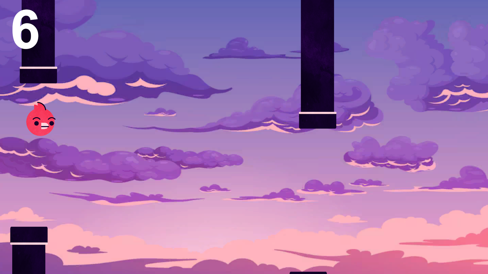
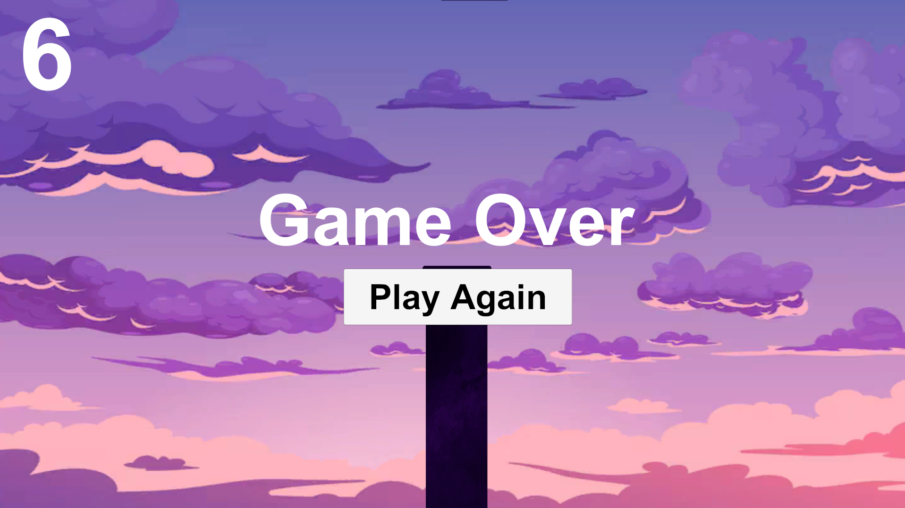

# Flappy Bird

A simple 2D Flappy Bird-style game made using Unity.

This project was created as a learning project to understand the basics of Unity game development and 2D game mechanics.

## About the Project

I created this game while following YouTube tutorials and learning how different Unity features work together.

The main purpose of this project was to practice:

- Unity 2D game development
- Player movement
- Physics and gravity
- Collision detection
- Game UI
- Score system
- Game over and restart functionality
- Basic scene management
- C# scripting in Unity

## Features

- Bird movement using keyboard input
- Pipes with random positions
- Collision detection
- Score tracking
- Game over screen
- Restart functionality
- Simple 2D gameplay

## Screenshots

### Gameplay

### Game Over

## Technologies Used

- Unity
- C#
- Unity 2D Physics
- TextMeshPro

## Purpose

This project was made for learning and practice. It is not intended to be a commercial or original recreation of the Flappy Bird game.

## Learning Source

The project was developed while following Unity game development tutorials on YouTube and modifying/understanding the concepts as part of my learning process.

## Author

Akash Gowda

GitHub: https://github.com/akash0953-py
